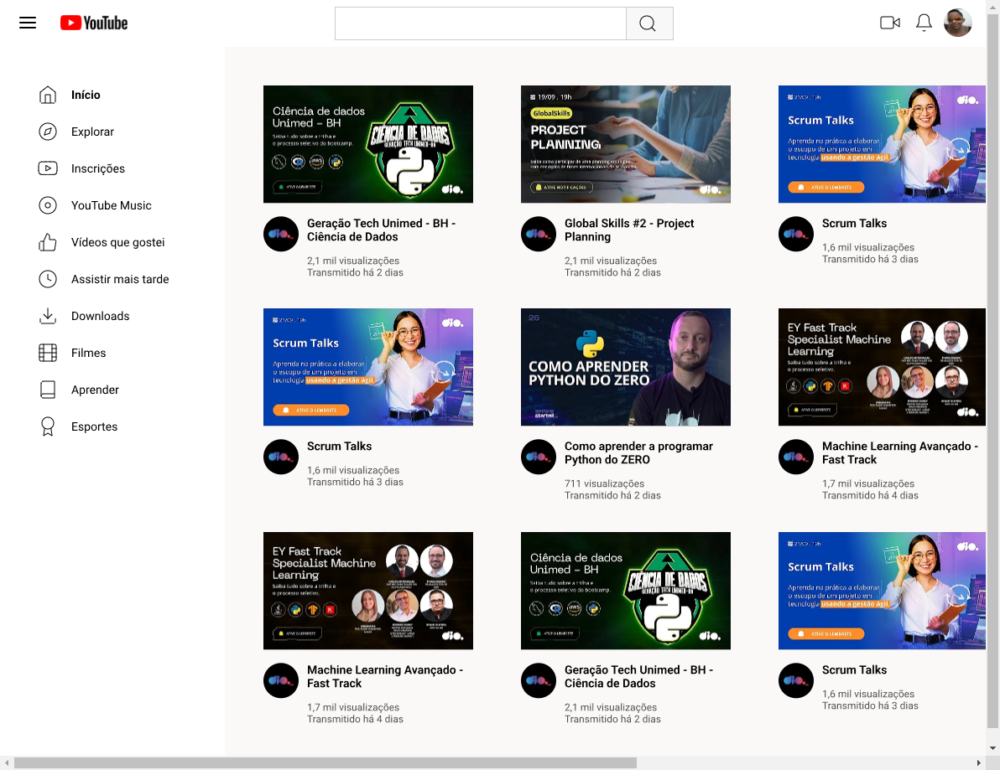

<h1 align="center">
  💻 Youtubeusando Grid
</h1>

<h4 align="center"><a href="https://douglasffjw.github.io/youtube_usando_grid/">Clique para visitar o projeto</a></h4>

## 📚 Objetivo

- **Neste Desafio da Dio coloquei a mão na massa e  Construi a Página de Listagem de vídeos no YouTube com CSS colocando em prática todos os conceitos aprendidos, principalmente sobre Grid Layout.** 

## 💼 Tecnologias utilizadas

Para o desenvolvimento deste site utilizei as seguintes tecnologias:

- HTML
- CSS

